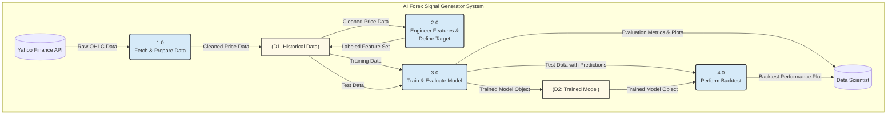

# AI-Driven Forex Signal Generator

### Author: Suraj [Your Last Name]
### Course: DLMCSPCSP01 - Project: Computer Science Project

---

## 1. Abstract

This project implements and evaluates a machine learning system to generate trading signals for the EUR/USD Forex pair. Addressing the complexity and emotional bias of manual trading, this system provides an objective, data-driven approach. Using historical data from 2015-2023, a feature set combining technical indicators (RSI, MACD, SMAs) and time-based components is engineered. A Random Forest Classifier is trained to predict future price movements, framed as a multi-class problem ('BUY', 'SELL', 'HOLD'). The system's design explicitly addresses time-series challenges like data leakage by using a chronological train-test split. The final model is evaluated not only on standard metrics like accuracy (64.31%) and F1-score but also through a practical backtesting simulation, which demonstrated a cumulative return of 1.35, outperforming a passive buy-and-hold strategy.

## 2. Introduction: Problem Definition and Context

The Foreign Exchange (Forex) market is a highly complex, non-linear, and stochastic environment. Predicting its behavior is a formidable challenge due to the vast number of influencing factors, from scheduled macroeconomic announcements to unpredictable geopolitical events. This project tackles a specific sub-problem: **generating short-to-medium term directional signals for a swing trading scenario.**

The core scientific problem is to identify statistically significant, repeatable patterns within historical price data that have predictive power over future price movements. This project operates on the premise that while markets may be largely efficient, temporary inefficiencies exist which can be captured by analyzing market momentum and trends.

**Dataset:** The system utilizes daily Open, High, Low, Close (OHLC) price data for the `EURUSD=X` pair, fetched from the Yahoo Finance API. This data represents the foundational input for all subsequent analysis.

## 3. Related Work and Academic Grounding

This project is grounded in established research in computational finance. Studies such as those by Chen et al. (2020) on using Support Vector Machines and Fischer & Krauss (2018) on applying LSTMs for market prediction have demonstrated the viability of machine learning in this domain. This project builds on these foundations by using a Random Forest model, chosen for its strong baseline performance and robustness against overfitting, as a practical and interpretable starting point for this classification task. (A full literature review is available in the final research report).

## 4. System Architecture and Technical Pipeline

To address the need for a clear system overview, the project follows a structured, modular pipeline. The architecture is visualized in the Data Flow Diagram (DFD) below.

### 4.1. Data Flow Diagram (Level 1)


### 4.2. Pipeline Stages:
1.  **Data Fetching:** Downloads raw daily price data.
2.  **Feature Engineering:** Calculates technical and time-based indicators.
3.  **Target Definition:** Creates the `BUY`/`SELL`/`HOLD` labels based on future price movement.
4.  **Model Training:** Trains the Random Forest Classifier on the historical data.
5.  **Model Evaluation:** Measures performance on unseen test data using classification metrics.
6.  **Backtesting:** Simulates the trading strategy to assess practical profitability.

## 5. Methodology and Model Justification

### 5.1. Model Selection: Random Forest Classifier
The **Random Forest Classifier** was chosen for several key reasons:
*   **Robustness:** As an ensemble method, it combines many decision trees to reduce the risk of overfitting to noise in the training data.
*   **Non-linearity:** It can capture complex, non-linear relationships between features and the target variable, which is essential for financial markets.
*   **Feature Importance:** It provides a built-in mechanism to rank the importance of each feature, offering valuable insight into the key drivers of the model's predictions.
*   **Strong Baseline:** It serves as a powerful and highly-regarded baseline model in machine learning.

### 5.2. Handling Time-Series Data and Preventing Data Leakage
A critical concern in time-series forecasting is **data leakage**, where information from the future "leaks" into the training process, leading to unrealistically optimistic results. This system prevents data leakage with a **strict chronological train-test split**. The data is split by date, with the first 80% used for training and the final 20% reserved for testing. The `shuffle=False` parameter is explicitly used to enforce this order.

### 5.3. Addressing Class Imbalance
Financial signals are naturally imbalanced (markets trend or reverse less often than they consolidate). To prevent the model from simply learning to always predict the majority 'HOLD' class, the `class_weight='balanced'` parameter was used during model training. This automatically adjusts the weight of each class to give more importance to the minority 'BUY' and 'SELL' classes.

## 6. Evaluation Plan
The model's performance is assessed through a two-tiered evaluation strategy:
1.  **Statistical Evaluation:** Standard classification metrics are used to measure the model's predictive accuracy on the test set.
    *   **Accuracy:** Overall percentage of correct predictions.
    *   **Precision, Recall, F1-Score:** Per-class metrics that measure the quality of predictions for BUY, SELL, and HOLD signals individually.
    *   **Confusion Matrix:** A visual breakdown of correct vs. incorrect predictions for each class.
2.  **Practical Evaluation (Backtesting):** A simulation is run on the test set where trades are executed based on the model's signals. The cumulative return of this strategy is plotted against a passive "Buy and Hold" benchmark. This provides a clear, intuitive measure of the model's practical financial utility.

## 7. Installation and Usage

### Prerequisites
*   Python 3.8 or higher
*   Pip package manager

### Installation
1.  Clone the repository:
    ```bash
    git clone https://github.com/your-username/ai-forex-signal-generator.git
    cd ai-forex-signal-generator
    ```
2.  Install the required libraries:
    ```bash
    pip install -r requirements.txt
    ```

### Usage
Run the main script from the terminal to execute the entire pipeline:
```bash
python signal_generator.py
```
The script will print evaluation results to the console and save the trained model and all output plots to the `output/` directory.

## 8. Future Scope and Deployment Ideas
This project serves as a strong foundation. Future work could involve:
*   **Implementing Advanced Models:** Exploring time-series specific models like LSTMs or GRUs.
*   **Alternative Data Integration:** Using NLP to incorporate sentiment from financial news.
*   **Deployment as an API:** The trained model could be wrapped in a Flask or FastAPI application to serve real-time predictions.